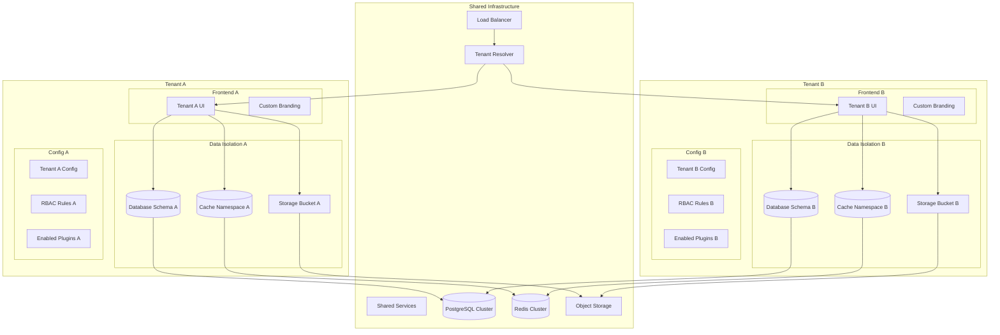
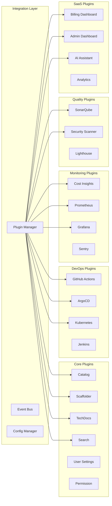
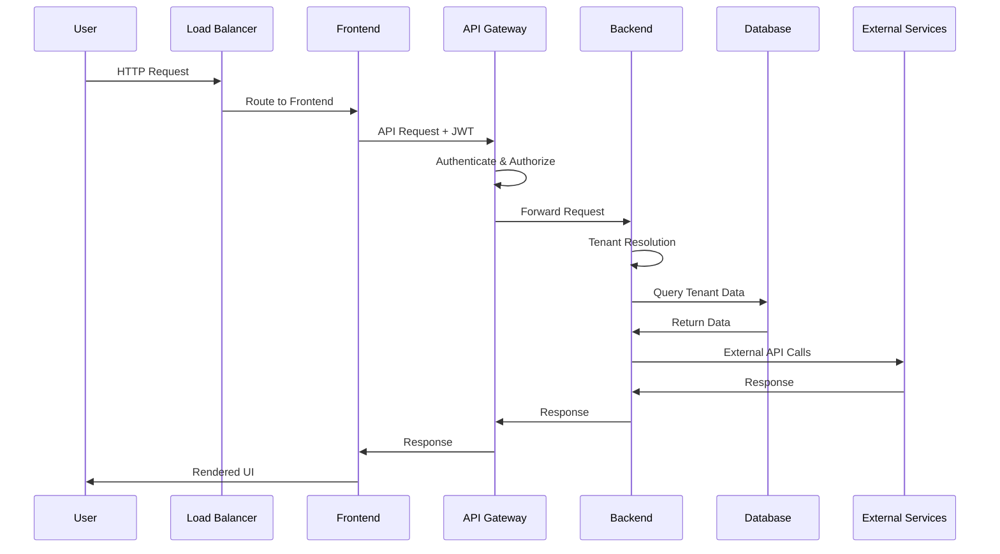
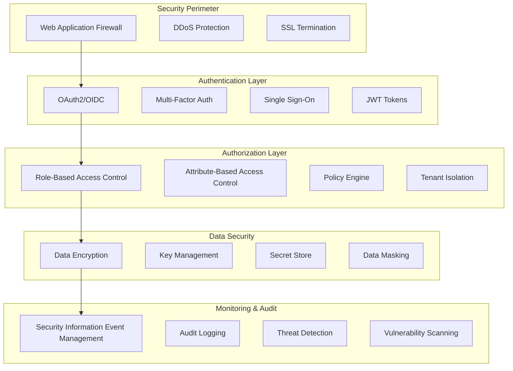
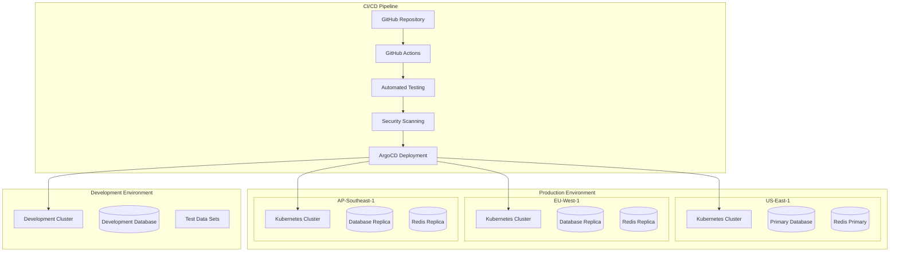
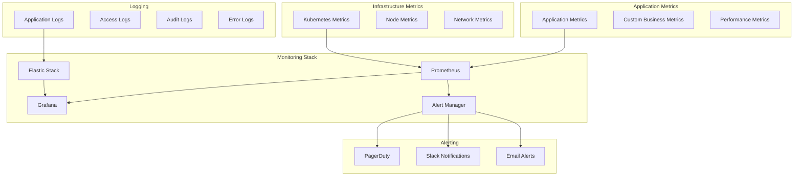
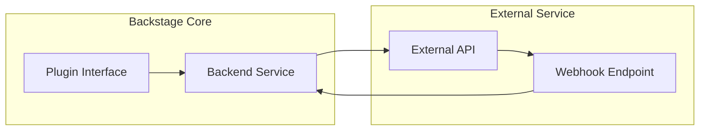
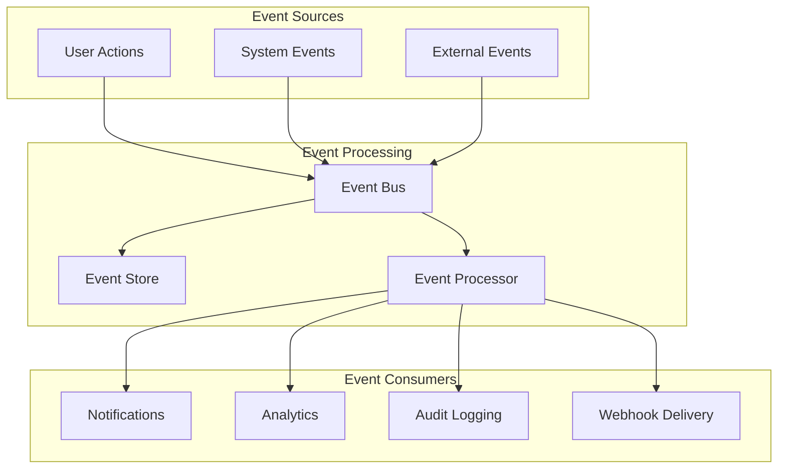

# Architecture Diagram - Backstage SaaS Platform

## System Architecture Overview

This document provides a comprehensive view of the Backstage SaaS platform architecture, including multi-tenant isolation, microservices design, and integration points.

## High-Level Architecture

```mermaid
graph TB
    subgraph "Client Layer"
        UI[Web UI React App]
        Mobile[Mobile App]
        CLI[CLI Tools]
        API_Client[API Clients]
    end

    subgraph "CDN & Load Balancer"
        CDN[CloudFront CDN]
        ALB[Application Load Balancer]
        WAF[Web Application Firewall]
    end

    subgraph "API Gateway Layer"
        Gateway[Kong API Gateway]
        RateLimit[Rate Limiting]
        Auth[Authentication]
        Monitoring[API Monitoring]
    end

    subgraph "Backstage Application Layer"
        subgraph "Frontend Services"
            Frontend[Backstage Frontend]
            StaticAssets[Static Assets]
        end
        
        subgraph "Backend Services"
            Backend[Backstage Backend]
            Catalog[Catalog Service]
            Scaffolder[Scaffolder Service]
            TechDocs[TechDocs Service]
            Search[Search Service]
            Auth_Service[Auth Service]
        end
    end

    subgraph "SaaS Enhancement Layer"
        Billing[Billing Service]
        AdminDash[Admin Dashboard]
        AI_Assistant[AI Assistant]
        MultiTenant[Multi-Tenant Manager]
        Analytics[Analytics Service]
        Notifications[Notification Service]
    end

    subgraph "Data Layer"
        PostgresMain[(PostgreSQL Main)]
        PostgresRead[(PostgreSQL Read Replica)]
        Redis[(Redis Cache)]
        S3[S3 Storage]
        ElasticSearch[(Elasticsearch)]
    end

    subgraph "External Integrations"
        GitHub[GitHub]
        GitLab[GitLab]
        Jenkins[Jenkins/GitHub Actions]
        ArgoCD[ArgoCD]
        Prometheus[Prometheus]
        Grafana[Grafana]
        SonarQube[SonarQube]
        Sentry[Sentry]
        Kubernetes[Kubernetes]
    end

    subgraph "Infrastructure"
        K8s[Kubernetes Cluster]
        Monitoring_Stack[Monitoring Stack]
        Logging[Centralized Logging]
        Secrets[Secret Management]
    end

    UI --> CDN
    Mobile --> CDN
    CLI --> Gateway
    API_Client --> Gateway
    
    CDN --> ALB
    ALB --> WAF
    WAF --> Gateway
    
    Gateway --> RateLimit
    Gateway --> Auth
    Gateway --> Monitoring
    
    Gateway --> Frontend
    Gateway --> Backend
    
    Backend --> Catalog
    Backend --> Scaffolder
    Backend --> TechDocs
    Backend --> Search
    Backend --> Auth_Service
    
    Backend --> Billing
    Backend --> AdminDash
    Backend --> AI_Assistant
    Backend --> MultiTenant
    Backend --> Analytics
    Backend --> Notifications
    
    Catalog --> PostgresMain
    Search --> ElasticSearch
    TechDocs --> S3
    Auth_Service --> Redis
    Billing --> PostgresMain
    Analytics --> PostgresRead
    
    Backend --> GitHub
    Backend --> GitLab
    Backend --> Jenkins
    Backend --> ArgoCD
    Backend --> Prometheus
    Backend --> Grafana
    Backend --> SonarQube
    Backend --> Sentry
    Backend --> Kubernetes
```

## Multi-Tenant Architecture

## Plugin Architecture

## Data Flow Architecture

## Security Architecture

## Deployment Architecture

## Monitoring & Observability

## Integration Patterns

### API Integration Pattern

### Event-Driven Pattern

## Scalability Considerations

### Horizontal Scaling
- **Stateless Services**: All application services designed to be stateless
- **Load Balancing**: Round-robin and health-check based routing
- **Auto-scaling**: Kubernetes HPA based on CPU, memory, and custom metrics
- **Database Scaling**: Read replicas and connection pooling

### Performance Optimization
- **Caching Strategy**: Multi-layer caching with Redis and CDN
- **Database Optimization**: Indexed queries and connection pooling
- **Asset Optimization**: Minification and compression
- **API Optimization**: GraphQL for efficient data fetching

### Disaster Recovery
- **Backup Strategy**: Automated daily backups with point-in-time recovery
- **Failover**: Automated failover to secondary regions
- **Data Replication**: Real-time replication across regions
- **Recovery Testing**: Monthly disaster recovery drills