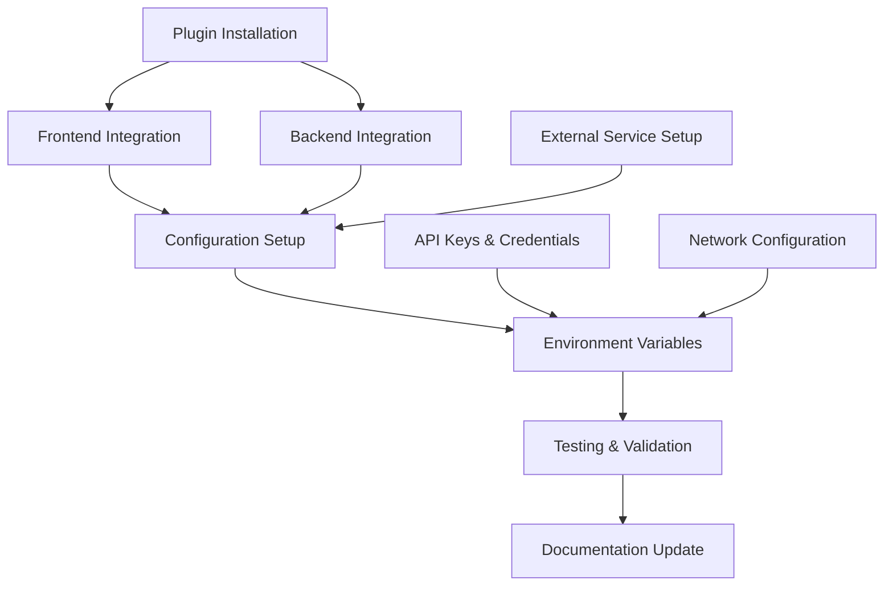

# Plugin Installation Plan - Backstage SaaS Platform

## Current Plugin Status

### ✅ Already Installed Core Plugins

| Plugin | Package | Frontend | Backend | Status | Notes |
|--------|---------|----------|---------|--------|-------|
| **Catalog** | `@backstage/plugin-catalog` | ✅ | ✅ | Active | Service registry and discovery |
| **TechDocs** | `@backstage/plugin-techdocs` | ✅ | ✅ | Active | Documentation platform |
| **Scaffolder** | `@backstage/plugin-scaffolder` | ✅ | ✅ | Active | Template-based code generation |
| **Search** | `@backstage/plugin-search` | ✅ | ✅ | Active | Global search functionality |
| **User Settings** | `@backstage/plugin-user-settings` | ✅ | ❌ | Active | User preferences |
| **Permission System** | `@backstage/plugin-permission-common` | ✅ | ✅ | Active | Authorization framework |
| **Auth Backend** | `@backstage/plugin-auth-backend` | ❌ | ✅ | Active | Authentication service |
| **API Docs** | `@backstage/plugin-api-docs` | ✅ | ❌ | Active | API documentation |
| **Catalog Import** | `@backstage/plugin-catalog-import` | ✅ | ❌ | Active | Service onboarding |
| **Notifications** | `@backstage/plugin-notifications` | ✅ | ✅ | Active | Alert system |
| **Kubernetes** | `@backstage/plugin-kubernetes` | ✅ | ✅ | Active | K8s cluster management |

## 🔧 Plugins to Install

### DevOps & CI/CD Plugins

#### 1. GitHub Actions Plugin
```bash
# Installation commands
yarn workspace app add @backstage/plugin-github-actions
yarn workspace backend add @backstage/plugin-github-actions-backend
```

**Configuration Required:**
- GitHub token with workflow permissions
- Webhook setup for real-time updates
- Repository annotations in catalog-info.yaml

**Integration Points:**
- Workflow status in service overview
- Build history and artifacts
- Deployment tracking

#### 2. ArgoCD Plugin
```bash
# Installation commands
yarn workspace app add @backstage/plugin-argo-cd
yarn workspace backend add @backstage/plugin-argo-cd-backend
```

**Configuration Required:**
- ArgoCD server URL and credentials
- Application mapping to catalog entities
- RBAC configuration for ArgoCD access

**Integration Points:**
- Deployment status and history
- Application sync status
- Rollback capabilities

#### 3. Jenkins Plugin (Alternative CI/CD)
```bash
# Installation commands
yarn workspace app add @backstage/plugin-jenkins
yarn workspace backend add @backstage/plugin-jenkins-backend
```

**Configuration Required:**
- Jenkins server credentials
- Job mapping to catalog entities
- Build trigger permissions

### Monitoring & Observability Plugins

#### 4. Cost Insights Plugin
```bash
# Installation commands
yarn workspace app add @backstage/plugin-cost-insights
yarn workspace backend add @backstage/plugin-cost-insights-backend
```

**Configuration Required:**
- Cloud provider billing APIs (AWS, GCP, Azure)
- Cost allocation tags and labels
- Budget thresholds and alerts

**Features:**
- Daily cost tracking per service
- Cost optimization recommendations
- Budget alerts and forecasting

#### 5. Prometheus Plugin
```bash
# Installation commands
yarn workspace app add @backstage/plugin-prometheus
```

**Configuration Required:**
- Prometheus server endpoints
- Query templates for common metrics
- Alert rule definitions

**Integration Points:**
- Real-time metrics dashboards
- SLA/SLO tracking
- Performance alerts

#### 6. Grafana Plugin
```bash
# Installation commands
yarn workspace app add @backstage/plugin-grafana
```

**Configuration Required:**
- Grafana server URL and API key
- Dashboard templates per service type
- Annotation synchronization

**Features:**
- Embedded dashboards
- Custom metric visualization
- Alert correlation

#### 7. Sentry Plugin
```bash
# Installation commands
yarn workspace app add @backstage/plugin-sentry
```

**Configuration Required:**
- Sentry organization and auth tokens
- Project mapping to catalog entities
- Error threshold configuration

**Integration Points:**
- Error rate tracking
- Performance monitoring
- Release health monitoring

### Code Quality & Security Plugins

#### 8. SonarQube Plugin
```bash
# Installation commands
yarn workspace app add @backstage/plugin-sonarqube
yarn workspace backend add @backstage/plugin-sonarqube-backend
```

**Configuration Required:**
- SonarQube server URL and tokens
- Project key mapping
- Quality gate definitions

**Features:**
- Code quality metrics
- Security vulnerability scanning
- Technical debt tracking

#### 9. Security Insights Plugin
```bash
# Installation commands
yarn workspace app add @backstage/plugin-security-insights
```

**Configuration Required:**
- Security scanning tool integrations
- Vulnerability database access
- Policy definitions

**Features:**
- Vulnerability dashboard
- Compliance tracking
- Security score metrics

## Installation Scripts

### Automated Installation Script

```bash
#!/bin/bash
# install-plugins.sh

set -e

echo "🔧 Installing Backstage SaaS Plugins..."

# DevOps Plugins
echo "📦 Installing GitHub Actions plugin..."
yarn workspace app add @backstage/plugin-github-actions
yarn workspace backend add @backstage/plugin-github-actions-backend

echo "📦 Installing ArgoCD plugin..."
yarn workspace app add @backstage/plugin-argo-cd
yarn workspace backend add @backstage/plugin-argo-cd-backend

# Monitoring Plugins
echo "📦 Installing Cost Insights plugin..."
yarn workspace app add @backstage/plugin-cost-insights
yarn workspace backend add @backstage/plugin-cost-insights-backend

echo "📦 Installing Prometheus plugin..."
yarn workspace app add @backstage/plugin-prometheus

echo "📦 Installing Grafana plugin..."
yarn workspace app add @backstage/plugin-grafana

echo "📦 Installing Sentry plugin..."
yarn workspace app add @backstage/plugin-sentry

# Quality Plugins
echo "📦 Installing SonarQube plugin..."
yarn workspace app add @backstage/plugin-sonarqube
yarn workspace backend add @backstage/plugin-sonarqube-backend

echo "✅ All plugins installed successfully!"
echo "🔧 Next steps:"
echo "1. Update app.tsx with new plugin routes"
echo "2. Update backend index.ts with new backend modules"
echo "3. Configure app-config.yaml with plugin settings"
echo "4. Restart the development server"
```

### Plugin Configuration Script

```bash
#!/bin/bash
# configure-plugins.sh

set -e

echo "⚙️ Configuring installed plugins..."

# Create plugin configuration directory
mkdir -p plugins/config

# Generate configuration templates
cat > plugins/config/github-actions.yaml << EOF
githubActions:
  proxyPath: /github-actions
integrations:
  github:
    - host: github.com
      token: \${GITHUB_TOKEN}
EOF

cat > plugins/config/argo-cd.yaml << EOF
argocd:
  baseUrl: \${ARGOCD_BASE_URL}
  username: \${ARGOCD_USERNAME}
  password: \${ARGOCD_PASSWORD}
  waitCycles: 25
EOF

cat > plugins/config/cost-insights.yaml << EOF
costInsights:
  engineerCost: 200000
  products:
    computeEngine:
      name: Compute Engine
      icon: compute
    cloudDataflow:
      name: Cloud Dataflow
      icon: data
EOF

echo "✅ Plugin configuration templates created!"
echo "📝 Edit the generated config files with your specific values"
```

## Frontend Integration (app.tsx Updates)

### Required App.tsx Changes

```typescript
// Add these imports to packages/app/src/App.tsx

// GitHub Actions
import { GitHubActionsPage } from '@backstage/plugin-github-actions';

// ArgoCD  
import { ArgocdPage } from '@backstage/plugin-argo-cd';

// Cost Insights
import { CostInsightsPage } from '@backstage/plugin-cost-insights';

// Prometheus
import { PrometheusPage } from '@backstage/plugin-prometheus';

// Grafana
import { GrafanaPage } from '@backstage/plugin-grafana';

// Sentry
import { SentryPage } from '@backstage/plugin-sentry';

// SonarQube
import { SonarqubeProjectDashboardPage } from '@backstage/plugin-sonarqube';

// Add these routes to the FlatRoutes component
const routes = (
  <FlatRoutes>
    {/* Existing routes */}
    
    {/* New plugin routes */}
    <Route path="/github-actions" element={<GitHubActionsPage />} />
    <Route path="/argo-cd" element={<ArgocdPage />} />
    <Route path="/cost-insights" element={<CostInsightsPage />} />
    <Route path="/prometheus" element={<PrometheusPage />} />
    <Route path="/grafana" element={<GrafanaPage />} />
    <Route path="/sentry" element={<SentryPage />} />
    <Route path="/sonarqube" element={<SonarqubeProjectDashboardPage />} />
  </FlatRoutes>
);
```

### Entity Page Integration

```typescript
// Add to packages/app/src/components/catalog/EntityPage.tsx

import { 
  GitHubActionsCard,
  isGitHubActionsAvailable 
} from '@backstage/plugin-github-actions';

import {
  ArgocdDeploymentSummaryCard,
  ArgocdDeploymentDetailsCard,
  isArgocdConfigured
} from '@backstage/plugin-argo-cd';

import {
  SonarqubeCard,
  isSonarqubeAvailable
} from '@backstage/plugin-sonarqube';

// Add cards to service overview page
const overviewContent = (
  <Grid container spacing={3} alignItems="stretch">
    {/* Existing cards */}
    
    <EntitySwitch>
      <EntitySwitch.Case if={isGitHubActionsAvailable}>
        <Grid item md={6}>
          <GitHubActionsCard />
        </Grid>
      </EntitySwitch.Case>
    </EntitySwitch>
    
    <EntitySwitch>
      <EntitySwitch.Case if={isArgocdConfigured}>
        <Grid item md={6}>
          <ArgocdDeploymentSummaryCard />
        </Grid>
      </EntitySwitch.Case>
    </EntitySwitch>
    
    <EntitySwitch>
      <EntitySwitch.Case if={isSonarqubeAvailable}>
        <Grid item md={6}>
          <SonarqubeCard />
        </Grid>
      </EntitySwitch.Case>
    </EntitySwitch>
  </Grid>
);
```

## Backend Integration (index.ts Updates)

### Required Backend Index.ts Changes

```typescript
// Add these imports to packages/backend/src/index.ts

// GitHub Actions
backend.add(import('@backstage/plugin-github-actions-backend'));

// ArgoCD
backend.add(import('@backstage/plugin-argo-cd-backend'));

// Cost Insights
backend.add(import('@backstage/plugin-cost-insights-backend'));

// SonarQube
backend.add(import('@backstage/plugin-sonarqube-backend'));

// Additional monitoring backends
backend.add(import('@backstage/plugin-prometheus-backend'));
```

## Configuration Updates (app-config.yaml)

### Plugin Configuration Block

```yaml
# Add to app-config.yaml

# GitHub Actions Integration
githubActions:
  proxyPath: /github-actions

# ArgoCD Integration
argocd:
  baseUrl: ${ARGOCD_BASE_URL}
  username: ${ARGOCD_USERNAME}
  password: ${ARGOCD_PASSWORD}
  waitCycles: 25

# Cost Insights Configuration
costInsights:
  engineerCost: 200000
  products:
    computeEngine:
      name: Compute Engine
      icon: compute
    cloudDataflow:
      name: Cloud Dataflow  
      icon: data
  metrics:
    DAU:
      name: Daily Active Users
      default: true
    MSC:
      name: Monthly Subscribers

# SonarQube Integration
sonarqube:
  baseUrl: ${SONARQUBE_URL}
  apiKey: ${SONARQUBE_API_KEY}

# Prometheus Configuration
prometheus:
  proxyPath: /prometheus/api
  uiUrl: ${PROMETHEUS_URL}

# Grafana Configuration  
grafana:
  domain: ${GRAFANA_DOMAIN}
  unifiedAlerting: true

# Sentry Configuration
sentry:
  organization: ${SENTRY_ORG}
  authToken: ${SENTRY_AUTH_TOKEN}

# Proxy endpoints for external services
proxy:
  endpoints:
    '/prometheus/api':
      target: ${PROMETHEUS_URL}
      credentials: ${PROMETHEUS_CREDENTIALS}
      
    '/grafana/api':
      target: ${GRAFANA_URL}
      credentials: ${GRAFANA_CREDENTIALS}
      
    '/sonarqube/api':
      target: ${SONARQUBE_URL}
      credentials: ${SONARQUBE_CREDENTIALS}
```

## Environment Variables

### Required Environment Variables

```bash
# Create .env file with these variables

# GitHub Integration
GITHUB_TOKEN=ghp_your_github_token_here

# ArgoCD Integration  
ARGOCD_BASE_URL=https://argocd.your-domain.com
ARGOCD_USERNAME=admin
ARGOCD_PASSWORD=your_argocd_password

# SonarQube Integration
SONARQUBE_URL=https://sonarqube.your-domain.com
SONARQUBE_API_KEY=your_sonarqube_api_key

# Prometheus Integration
PROMETHEUS_URL=https://prometheus.your-domain.com
PROMETHEUS_CREDENTIALS=your_prometheus_credentials

# Grafana Integration
GRAFANA_DOMAIN=grafana.your-domain.com
GRAFANA_URL=https://grafana.your-domain.com
GRAFANA_CREDENTIALS=your_grafana_credentials

# Sentry Integration
SENTRY_ORG=your-sentry-organization
SENTRY_AUTH_TOKEN=your_sentry_auth_token
```

## Testing & Validation

### Plugin Installation Validation Script

```bash
#!/bin/bash
# validate-plugins.sh

set -e

echo "🧪 Validating plugin installations..."

# Check if packages are installed
echo "📦 Checking package installations..."
yarn workspace app why @backstage/plugin-github-actions
yarn workspace app why @backstage/plugin-argo-cd  
yarn workspace app why @backstage/plugin-cost-insights
yarn workspace app why @backstage/plugin-prometheus
yarn workspace app why @backstage/plugin-grafana
yarn workspace app why @backstage/plugin-sentry
yarn workspace app why @backstage/plugin-sonarqube

# Build test
echo "🏗️ Testing build..."
yarn workspace app build
yarn workspace backend build

# Configuration validation
echo "⚙️ Validating configuration..."
node -e "
const config = require('./packages/backend/dist/index.js');
console.log('Configuration loaded successfully');
"

echo "✅ All validations passed!"
```

### Mock Data Setup

```bash
#!/bin/bash
# setup-mock-data.sh

set -e

echo "🎭 Setting up mock data for plugins..."

# Create mock catalog entities with plugin annotations
cat > examples/plugin-demo-entities.yaml << EOF
apiVersion: backstage.io/v1alpha1
kind: Component
metadata:
  name: demo-service
  annotations:
    github.com/project-slug: your-org/demo-service
    argocd/app-name: demo-service
    sonarqube.org/project-key: demo-service
    sentry.io/project-slug: demo-service
    grafana.com/dashboard-url: https://grafana.com/d/demo-service
spec:
  type: service
  lifecycle: production
  owner: platform-team
EOF

echo "✅ Mock data created!"
```

## Integration Effort Estimation

### Development Effort by Plugin

| Plugin | Frontend Effort | Backend Effort | Configuration | Total Days |
|--------|-----------------|----------------|---------------|------------|
| GitHub Actions | 1 day | 1 day | 0.5 days | 2.5 days |
| ArgoCD | 1.5 days | 1 day | 1 day | 3.5 days |
| Cost Insights | 2 days | 2 days | 1 day | 5 days |
| Prometheus | 0.5 days | 0.5 days | 0.5 days | 1.5 days |
| Grafana | 0.5 days | 0.5 days | 0.5 days | 1.5 days |
| Sentry | 1 day | 0.5 days | 0.5 days | 2 days |
| SonarQube | 1 day | 1 day | 0.5 days | 2.5 days |
| **Total** | **7.5 days** | **6.5 days** | **4 days** | **18 days** |

### Integration Dependencies



## Success Criteria

### Plugin Installation Success Metrics

- [ ] All 7 target plugins installed without conflicts
- [ ] Frontend builds successfully with new plugins
- [ ] Backend starts without errors
- [ ] Plugin routes accessible and functional
- [ ] Configuration validates successfully
- [ ] Integration tests pass for each plugin
- [ ] Documentation updated with new features
- [ ] Performance impact within acceptable limits (<10% increase in load time)

### User Experience Goals

- [ ] Plugin features discoverable through navigation
- [ ] Consistent UI/UX across all plugin interfaces
- [ ] Error handling and fallbacks for external service outages
- [ ] Mobile-responsive plugin interfaces
- [ ] Accessibility compliance (WCAG 2.1 AA)
- [ ] Fast loading times (<3 seconds for plugin pages)

## Maintenance & Updates

### Plugin Update Strategy

1. **Monthly Security Updates**: Apply security patches within 48 hours
2. **Quarterly Feature Updates**: Evaluate and apply feature updates
3. **Annual Major Upgrades**: Plan for major version upgrades
4. **Dependency Management**: Regular audit of plugin dependencies

### Monitoring Plugin Health

- Plugin-specific error tracking
- Performance monitoring per plugin
- Usage analytics to identify adoption
- User feedback collection
- Automated security vulnerability scanning

---

This plugin installation plan provides a comprehensive roadmap for enhancing the Backstage SaaS platform with essential DevOps, monitoring, and quality plugins while maintaining system stability and user experience.