# Deployment Plan - Backstage SaaS Platform

## CI/CD Pipeline Architecture

### Overview

The deployment strategy employs a GitOps approach using GitHub Actions for CI/CD and ArgoCD for continuous deployment. This ensures automated, secure, and scalable deployments across multiple environments with proper rollback capabilities.

### Pipeline Stages

```mermaid
graph LR
    A[Code Push] --> B[CI Pipeline]
    B --> C[Build & Test]
    C --> D[Security Scan]
    D --> E[Build Images]
    E --> F[Push to Registry]
    F --> G[Update Manifests]
    G --> H[ArgoCD Sync]
    H --> I[Deploy to Staging]
    I --> J[Integration Tests]
    J --> K[Deploy to Production]
    K --> L[Health Checks]
    L --> M[Rollback if Failed]
```



## GitHub Actions Workflows

### Main CI/CD Workflow

```yaml
# .github/workflows/ci-cd.yml
name: CI/CD Pipeline

on:
  push:
    branches: [main, develop]
  pull_request:
    branches: [main]

env:
  REGISTRY: ghcr.io
  IMAGE_NAME: ${{ github.repository }}
  NODE_VERSION: '20'

jobs:
  test:
    name: Test and Lint
    runs-on: ubuntu-latest
    
    services:
      postgres:
        image: postgres:13
        env:
          POSTGRES_USER: backstage
          POSTGRES_PASSWORD: backstage
          POSTGRES_DB: backstage
        options: >-
          --health-cmd pg_isready
          --health-interval 10s
          --health-timeout 5s
          --health-retries 5
        ports:
          - 5432:5432
    
    steps:
      - name: Checkout code
        uses: actions/checkout@v4
        
      - name: Setup Node.js
        uses: actions/setup-node@v4
        with:
          node-version: ${{ env.NODE_VERSION }}
          cache: 'yarn'
          
      - name: Install dependencies
        run: yarn install --immutable
        
      - name: Lint code
        run: yarn lint:all
        
      - name: Type check
        run: yarn tsc:full
        
      - name: Run tests
        run: yarn test:all
        env:
          POSTGRES_HOST: localhost
          POSTGRES_PORT: 5432
          POSTGRES_USER: backstage
          POSTGRES_PASSWORD: backstage
          POSTGRES_DATABASE: backstage
          
      - name: Build packages
        run: yarn build:all
        
      - name: Upload coverage reports
        uses: codecov/codecov-action@v3
        with:
          file: ./coverage/lcov.info

  security:
    name: Security Scanning
    runs-on: ubuntu-latest
    needs: test
    
    steps:
      - name: Checkout code
        uses: actions/checkout@v4
        
      - name: Run Trivy vulnerability scanner
        uses: aquasecurity/trivy-action@master
        with:
          scan-type: 'fs'
          scan-ref: '.'
          format: 'sarif'
          output: 'trivy-results.sarif'
          
      - name: Upload Trivy scan results
        uses: github/codeql-action/upload-sarif@v2
        with:
          sarif_file: 'trivy-results.sarif'
          
      - name: Run Snyk security scan
        uses: snyk/actions/node@master
        env:
          SNYK_TOKEN: ${{ secrets.SNYK_TOKEN }}
        with:
          args: --severity-threshold=high
          
      - name: OWASP Dependency Check
        uses: dependency-check/Dependency-Check_Action@main
        with:
          project: 'backstage-saas'
          path: '.'
          format: 'JSON'
          
  build:
    name: Build and Push Images
    runs-on: ubuntu-latest
    needs: [test, security]
    if: github.ref == 'refs/heads/main'
    
    permissions:
      contents: read
      packages: write
      
    strategy:
      matrix:
        component: [frontend, backend]
        
    steps:
      - name: Checkout code
        uses: actions/checkout@v4
        
      - name: Setup Node.js
        uses: actions/setup-node@v4
        with:
          node-version: ${{ env.NODE_VERSION }}
          cache: 'yarn'
          
      - name: Install dependencies
        run: yarn install --immutable
        
      - name: Build application
        run: yarn build:all
        
      - name: Login to Container Registry
        uses: docker/login-action@v3
        with:
          registry: ${{ env.REGISTRY }}
          username: ${{ github.actor }}
          password: ${{ secrets.GITHUB_TOKEN }}
          
      - name: Extract metadata
        id: meta
        uses: docker/metadata-action@v5
        with:
          images: ${{ env.REGISTRY }}/${{ env.IMAGE_NAME }}-${{ matrix.component }}
          tags: |
            type=ref,event=branch
            type=ref,event=pr
            type=sha
            type=raw,value=latest,enable={{is_default_branch}}
            
      - name: Build and push Docker image
        uses: docker/build-push-action@v5
        with:
          context: .
          file: packages/${{ matrix.component }}/Dockerfile
          push: true
          tags: ${{ steps.meta.outputs.tags }}
          labels: ${{ steps.meta.outputs.labels }}
          cache-from: type=gha
          cache-to: type=gha,mode=max

  deploy-staging:
    name: Deploy to Staging
    runs-on: ubuntu-latest
    needs: build
    if: github.ref == 'refs/heads/main'
    
    environment:
      name: staging
      url: https://staging.backstage-saas.com
      
    steps:
      - name: Checkout GitOps repository
        uses: actions/checkout@v4
        with:
          repository: ${{ github.repository }}-gitops
          token: ${{ secrets.GITOPS_TOKEN }}
          path: gitops
          
      - name: Update staging manifests
        run: |
          cd gitops/staging
          
          # Update image tags
          sed -i "s|image: .*frontend.*|image: ${{ env.REGISTRY }}/${{ env.IMAGE_NAME }}-frontend:${{ github.sha }}|g" backstage-frontend.yaml
          sed -i "s|image: .*backend.*|image: ${{ env.REGISTRY }}/${{ env.IMAGE_NAME }}-backend:${{ github.sha }}|g" backstage-backend.yaml
          
          # Commit changes
          git config user.name "GitHub Actions"
          git config user.email "actions@github.com"
          git add .
          git commit -m "Deploy ${{ github.sha }} to staging"
          git push
          
      - name: Wait for ArgoCD sync
        run: |
          # Wait for ArgoCD to sync the changes
          sleep 60
          
      - name: Health check
        run: |
          curl -f https://staging.backstage-saas.com/api/health || exit 1

  integration-tests:
    name: Integration Tests
    runs-on: ubuntu-latest
    needs: deploy-staging
    
    steps:
      - name: Checkout code
        uses: actions/checkout@v4
        
      - name: Setup Node.js
        uses: actions/setup-node@v4
        with:
          node-version: ${{ env.NODE_VERSION }}
          cache: 'yarn'
          
      - name: Install dependencies
        run: yarn install --immutable
        
      - name: Run integration tests
        run: yarn test:integration
        env:
          TEST_BASE_URL: https://staging.backstage-saas.com
          
      - name: Run E2E tests
        run: yarn test:e2e
        env:
          BASE_URL: https://staging.backstage-saas.com

  deploy-production:
    name: Deploy to Production
    runs-on: ubuntu-latest
    needs: integration-tests
    if: github.ref == 'refs/heads/main'
    
    environment:
      name: production
      url: https://backstage-saas.com
      
    steps:
      - name: Checkout GitOps repository
        uses: actions/checkout@v4
        with:
          repository: ${{ github.repository }}-gitops
          token: ${{ secrets.GITOPS_TOKEN }}
          path: gitops
          
      - name: Update production manifests
        run: |
          cd gitops/production
          
          # Update image tags
          sed -i "s|image: .*frontend.*|image: ${{ env.REGISTRY }}/${{ env.IMAGE_NAME }}-frontend:${{ github.sha }}|g" backstage-frontend.yaml
          sed -i "s|image: .*backend.*|image: ${{ env.REGISTRY }}/${{ env.IMAGE_NAME }}-backend:${{ github.sha }}|g" backstage-backend.yaml
          
          # Commit changes
          git config user.name "GitHub Actions"
          git config user.email "actions@github.com"
          git add .
          git commit -m "Deploy ${{ github.sha }} to production"
          git push
          
      - name: Wait for ArgoCD sync
        run: |
          sleep 120  # Longer wait for production
          
      - name: Health check
        run: |
          curl -f https://backstage-saas.com/api/health || exit 1
          
      - name: Smoke tests
        run: |
          # Run critical path smoke tests
          curl -f https://backstage-saas.com/api/catalog/entities || exit 1
          curl -f https://backstage-saas.com/api/search/query?term=test || exit 1
```

### Hotfix Workflow

```yaml
# .github/workflows/hotfix.yml
name: Hotfix Deployment

on:
  push:
    branches: [hotfix/*]

jobs:
  hotfix-deploy:
    name: Emergency Hotfix
    runs-on: ubuntu-latest
    if: startsWith(github.ref, 'refs/heads/hotfix/')
    
    environment:
      name: production-hotfix
      
    steps:
      - name: Checkout code
        uses: actions/checkout@v4
        
      - name: Emergency build and deploy
        run: |
          # Fast-track deployment process
          echo "Deploying hotfix: ${{ github.ref_name }}"
          
      - name: Notify team
        uses: 8398a7/action-slack@v3
        with:
          status: ${{ job.status }}
          text: "🚨 Hotfix deployed: ${{ github.ref_name }}"
        env:
          SLACK_WEBHOOK_URL: ${{ secrets.SLACK_WEBHOOK_URL }}
```

## Docker Configuration

### Frontend Dockerfile

```dockerfile
# packages/app/Dockerfile
FROM node:20-alpine AS builder

WORKDIR /app

# Copy package files
COPY package.json yarn.lock .yarnrc.yml ./
COPY .yarn ./.yarn
COPY packages/app/package.json ./packages/app/
COPY packages/backend/package.json ./packages/backend/

# Install dependencies
RUN yarn install --immutable

# Copy source code
COPY . .

# Build the application
RUN yarn build:all

# Production image
FROM nginx:alpine

# Copy built assets
COPY --from=builder /app/packages/app/dist /usr/share/nginx/html

# Copy nginx configuration
COPY packages/app/nginx.conf /etc/nginx/nginx.conf

# Add health check
HEALTHCHECK --interval=30s --timeout=3s --start-period=5s --retries=3 \
  CMD curl -f http://localhost:80/ || exit 1

EXPOSE 80

CMD ["nginx", "-g", "daemon off;"]
```

### Backend Dockerfile

```dockerfile
# packages/backend/Dockerfile
FROM node:20-alpine AS builder

WORKDIR /app

# Install system dependencies
RUN apk add --no-cache python3 make g++

# Copy package files
COPY package.json yarn.lock .yarnrc.yml ./
COPY .yarn ./.yarn
COPY packages/backend/package.json ./packages/backend/
COPY packages/app/package.json ./packages/app/

# Install dependencies
RUN yarn install --immutable

# Copy source code
COPY . .

# Build the application
RUN yarn build:backend

# Production image
FROM node:20-alpine

WORKDIR /app

# Install system dependencies
RUN apk add --no-cache python3 make g++ curl

# Create non-root user
RUN addgroup -g 1001 -S backstage && \
    adduser -S backstage -u 1001

# Copy built application
COPY --from=builder --chown=backstage:backstage /app/packages/backend/dist ./

# Install production dependencies only
COPY --from=builder /app/node_modules ./node_modules

# Switch to non-root user
USER backstage

# Add health check
HEALTHCHECK --interval=30s --timeout=3s --start-period=5s --retries=3 \
  CMD curl -f http://localhost:7007/api/health || exit 1

EXPOSE 7007

CMD ["node", "packages/backend", "--config", "app-config.yaml", "--config", "app-config.production.yaml"]
```

## Kubernetes Manifests

### Namespace Configuration

```yaml
# k8s/base/namespace.yaml
apiVersion: v1
kind: Namespace
metadata:
  name: backstage-saas
  labels:
    name: backstage-saas
    app: backstage
---
apiVersion: v1
kind: Namespace
metadata:
  name: backstage-staging
  labels:
    name: backstage-staging
    app: backstage
```

### PostgreSQL Database

```yaml
# k8s/base/postgres.yaml
apiVersion: apps/v1
kind: StatefulSet
metadata:
  name: postgres
  namespace: backstage-saas
spec:
  serviceName: postgres
  replicas: 1
  selector:
    matchLabels:
      app: postgres
  template:
    metadata:
      labels:
        app: postgres
    spec:
      containers:
      - name: postgres
        image: postgres:13
        env:
        - name: POSTGRES_USER
          valueFrom:
            secretKeyRef:
              name: postgres-secret
              key: username
        - name: POSTGRES_PASSWORD
          valueFrom:
            secretKeyRef:
              name: postgres-secret
              key: password
        - name: POSTGRES_DB
          value: backstage
        ports:
        - containerPort: 5432
        volumeMounts:
        - name: postgres-storage
          mountPath: /var/lib/postgresql/data
        resources:
          requests:
            memory: "512Mi"
            cpu: "250m"
          limits:
            memory: "1Gi"
            cpu: "500m"
  volumeClaimTemplates:
  - metadata:
      name: postgres-storage
    spec:
      accessModes: ["ReadWriteOnce"]
      resources:
        requests:
          storage: 10Gi
---
apiVersion: v1
kind: Service
metadata:
  name: postgres
  namespace: backstage-saas
spec:
  selector:
    app: postgres
  ports:
  - port: 5432
    targetPort: 5432
```

### Backend Deployment

```yaml
# k8s/base/backend.yaml
apiVersion: apps/v1
kind: Deployment
metadata:
  name: backstage-backend
  namespace: backstage-saas
spec:
  replicas: 3
  selector:
    matchLabels:
      app: backstage-backend
  template:
    metadata:
      labels:
        app: backstage-backend
    spec:
      containers:
      - name: backstage-backend
        image: ghcr.io/your-org/backstage-saas-backend:latest
        ports:
        - containerPort: 7007
        env:
        - name: NODE_ENV
          value: production
        - name: POSTGRES_HOST
          value: postgres
        - name: POSTGRES_USER
          valueFrom:
            secretKeyRef:
              name: postgres-secret
              key: username
        - name: POSTGRES_PASSWORD
          valueFrom:
            secretKeyRef:
              name: postgres-secret
              key: password
        - name: BACKEND_SECRET
          valueFrom:
            secretKeyRef:
              name: backstage-secret
              key: backend-secret
        envFrom:
        - configMapRef:
            name: backstage-config
        - secretRef:
            name: backstage-integrations
        livenessProbe:
          httpGet:
            path: /api/health
            port: 7007
          initialDelaySeconds: 30
          periodSeconds: 10
        readinessProbe:
          httpGet:
            path: /api/health
            port: 7007
          initialDelaySeconds: 10
          periodSeconds: 5
        resources:
          requests:
            memory: "512Mi"
            cpu: "250m"
          limits:
            memory: "1Gi"
            cpu: "500m"
---
apiVersion: v1
kind: Service
metadata:
  name: backstage-backend
  namespace: backstage-saas
spec:
  selector:
    app: backstage-backend
  ports:
  - port: 7007
    targetPort: 7007
```

### Frontend Deployment

```yaml
# k8s/base/frontend.yaml
apiVersion: apps/v1
kind: Deployment
metadata:
  name: backstage-frontend
  namespace: backstage-saas
spec:
  replicas: 3
  selector:
    matchLabels:
      app: backstage-frontend
  template:
    metadata:
      labels:
        app: backstage-frontend
    spec:
      containers:
      - name: backstage-frontend
        image: ghcr.io/your-org/backstage-saas-frontend:latest
        ports:
        - containerPort: 80
        livenessProbe:
          httpGet:
            path: /
            port: 80
          initialDelaySeconds: 30
          periodSeconds: 10
        readinessProbe:
          httpGet:
            path: /
            port: 80
          initialDelaySeconds: 10
          periodSeconds: 5
        resources:
          requests:
            memory: "128Mi"
            cpu: "100m"
          limits:
            memory: "256Mi"
            cpu: "200m"
---
apiVersion: v1
kind: Service
metadata:
  name: backstage-frontend
  namespace: backstage-saas
spec:
  selector:
    app: backstage-frontend
  ports:
  - port: 80
    targetPort: 80
```

### Ingress Configuration

```yaml
# k8s/base/ingress.yaml
apiVersion: networking.k8s.io/v1
kind: Ingress
metadata:
  name: backstage-ingress
  namespace: backstage-saas
  annotations:
    kubernetes.io/ingress.class: nginx
    cert-manager.io/cluster-issuer: letsencrypt-prod
    nginx.ingress.kubernetes.io/rewrite-target: /
    nginx.ingress.kubernetes.io/ssl-redirect: "true"
    nginx.ingress.kubernetes.io/force-ssl-redirect: "true"
    nginx.ingress.kubernetes.io/proxy-body-size: "10m"
    nginx.ingress.kubernetes.io/rate-limit: "100"
    nginx.ingress.kubernetes.io/rate-limit-window: "1m"
spec:
  tls:
  - hosts:
    - backstage-saas.com
    - "*.backstage-saas.com"
    secretName: backstage-tls
  rules:
  - host: backstage-saas.com
    http:
      paths:
      - path: /api
        pathType: Prefix
        backend:
          service:
            name: backstage-backend
            port:
              number: 7007
      - path: /
        pathType: Prefix
        backend:
          service:
            name: backstage-frontend
            port:
              number: 80
  - host: "*.backstage-saas.com"
    http:
      paths:
      - path: /api
        pathType: Prefix
        backend:
          service:
            name: backstage-backend
            port:
              number: 7007
      - path: /
        pathType: Prefix
        backend:
          service:
            name: backstage-frontend
            port:
              number: 80
```

## Secret Management

### Kubernetes Secrets

```yaml
# k8s/base/secrets.yaml
apiVersion: v1
kind: Secret
metadata:
  name: postgres-secret
  namespace: backstage-saas
type: Opaque
data:
  username: YmFja3N0YWdl  # backstage (base64)
  password: <base64-encoded-password>
---
apiVersion: v1
kind: Secret
metadata:
  name: backstage-secret
  namespace: backstage-saas
type: Opaque
data:
  backend-secret: <base64-encoded-backend-secret>
---
apiVersion: v1
kind: Secret
metadata:
  name: backstage-integrations
  namespace: backstage-saas
type: Opaque
data:
  GITHUB_TOKEN: <base64-encoded-github-token>
  ARGOCD_PASSWORD: <base64-encoded-argocd-password>
  SONARQUBE_API_KEY: <base64-encoded-sonarqube-key>
  STRIPE_SECRET_KEY: <base64-encoded-stripe-key>
  OPENAI_API_KEY: <base64-encoded-openai-key>
```

### External Secrets Operator

```yaml
# k8s/base/external-secrets.yaml
apiVersion: external-secrets.io/v1beta1
kind: SecretStore
metadata:
  name: vault-secret-store
  namespace: backstage-saas
spec:
  provider:
    vault:
      server: "https://vault.company.com"
      path: "backstage"
      version: "v2"
      auth:
        kubernetes:
          mountPath: "kubernetes"
          role: "backstage-saas"
---
apiVersion: external-secrets.io/v1beta1
kind: ExternalSecret
metadata:
  name: backstage-secrets
  namespace: backstage-saas
spec:
  refreshInterval: 15s
  secretStoreRef:
    name: vault-secret-store
    kind: SecretStore
  target:
    name: backstage-integrations
    creationPolicy: Owner
  data:
  - secretKey: GITHUB_TOKEN
    remoteRef:
      key: github
      property: token
  - secretKey: STRIPE_SECRET_KEY
    remoteRef:
      key: stripe
      property: secret_key
```

## ArgoCD Configuration

### Application Definition

```yaml
# argocd/backstage-application.yaml
apiVersion: argoproj.io/v1alpha1
kind: Application
metadata:
  name: backstage-saas
  namespace: argocd
  finalizers:
    - resources-finalizer.argocd.argoproj.io
spec:
  project: default
  source:
    repoURL: https://github.com/your-org/backstage-saas-gitops
    targetRevision: main
    path: k8s/overlays/production
  destination:
    server: https://kubernetes.default.svc
    namespace: backstage-saas
  syncPolicy:
    automated:
      prune: true
      selfHeal: true
      allowEmpty: false
    syncOptions:
    - CreateNamespace=true
    - PrunePropagationPolicy=foreground
    - PruneLast=true
    retry:
      limit: 5
      backoff:
        duration: 5s
        factor: 2
        maxDuration: 3m
  revisionHistoryLimit: 10
```

### Rollback Strategy

```yaml
# argocd/rollback-policy.yaml
apiVersion: argoproj.io/v1alpha1
kind: AppProject
metadata:
  name: backstage-project
  namespace: argocd
spec:
  description: Backstage SaaS Project
  sourceRepos:
  - 'https://github.com/your-org/backstage-saas-gitops'
  destinations:
  - namespace: backstage-saas
    server: https://kubernetes.default.svc
  - namespace: backstage-staging
    server: https://kubernetes.default.svc
  clusterResourceWhitelist:
  - group: ''
    kind: Namespace
  - group: 'networking.k8s.io'
    kind: Ingress
  namespaceResourceWhitelist:
  - group: ''
    kind: '*'
  - group: 'apps'
    kind: '*'
  - group: 'networking.k8s.io'
    kind: '*'
  roles:
  - name: admin
    policies:
    - p, proj:backstage-project:admin, applications, *, backstage-project/*, allow
    - p, proj:backstage-project:admin, repositories, *, *, allow
    groups:
    - platform-team
  - name: developer
    policies:
    - p, proj:backstage-project:developer, applications, get, backstage-project/*, allow
    - p, proj:backstage-project:developer, applications, sync, backstage-project/*, allow
    groups:
    - development-team
```

## Monitoring and Alerting

### Prometheus Configuration

```yaml
# k8s/monitoring/prometheus.yaml
apiVersion: monitoring.coreos.com/v1
kind: ServiceMonitor
metadata:
  name: backstage-backend
  namespace: backstage-saas
spec:
  selector:
    matchLabels:
      app: backstage-backend
  endpoints:
  - port: "7007"
    path: /api/metrics
    interval: 30s
---
apiVersion: monitoring.coreos.com/v1
kind: PrometheusRule
metadata:
  name: backstage-alerts
  namespace: backstage-saas
spec:
  groups:
  - name: backstage.rules
    rules:
    - alert: BackstageDown
      expr: up{job="backstage-backend"} == 0
      for: 1m
      labels:
        severity: critical
      annotations:
        summary: "Backstage instance is down"
        description: "Backstage backend has been down for more than 1 minute"
    
    - alert: HighErrorRate
      expr: rate(http_requests_total{status=~"5.."}[5m]) > 0.1
      for: 5m
      labels:
        severity: warning
      annotations:
        summary: "High error rate detected"
        description: "Error rate is {{ $value }} for 5 minutes"
    
    - alert: HighResponseTime
      expr: histogram_quantile(0.95, http_request_duration_seconds_bucket) > 2
      for: 10m
      labels:
        severity: warning
      annotations:
        summary: "High response time"
        description: "95th percentile response time is {{ $value }}s"
```

### Grafana Dashboards

```json
{
  "dashboard": {
    "title": "Backstage SaaS Dashboard",
    "panels": [
      {
        "title": "Request Rate",
        "type": "graph",
        "targets": [
          {
            "expr": "rate(http_requests_total[5m])",
            "legendFormat": "{{method}} {{status}}"
          }
        ]
      },
      {
        "title": "Response Time",
        "type": "graph", 
        "targets": [
          {
            "expr": "histogram_quantile(0.95, http_request_duration_seconds_bucket)",
            "legendFormat": "95th percentile"
          }
        ]
      },
      {
        "title": "Active Users",
        "type": "stat",
        "targets": [
          {
            "expr": "active_users_total",
            "legendFormat": "Active Users"
          }
        ]
      }
    ]
  }
}
```

## Backup and Disaster Recovery

### Database Backup Strategy

```yaml
# k8s/backup/postgres-backup.yaml
apiVersion: batch/v1
kind: CronJob
metadata:
  name: postgres-backup
  namespace: backstage-saas
spec:
  schedule: "0 2 * * *"  # Daily at 2 AM
  jobTemplate:
    spec:
      template:
        spec:
          containers:
          - name: postgres-backup
            image: postgres:13
            command:
            - /bin/bash
            - -c
            - |
              pg_dump -h postgres -U $POSTGRES_USER -d backstage | \
              gzip > /backup/backup-$(date +%Y%m%d_%H%M%S).sql.gz
              
              # Upload to S3
              aws s3 cp /backup/ s3://backstage-backups/ --recursive
              
              # Clean old local backups
              find /backup -name "*.sql.gz" -mtime +7 -delete
            env:
            - name: POSTGRES_USER
              valueFrom:
                secretKeyRef:
                  name: postgres-secret
                  key: username
            - name: PGPASSWORD
              valueFrom:
                secretKeyRef:
                  name: postgres-secret
                  key: password
            volumeMounts:
            - name: backup-storage
              mountPath: /backup
          volumes:
          - name: backup-storage
            persistentVolumeClaim:
              claimName: backup-pvc
          restartPolicy: OnFailure
```

### Disaster Recovery Runbook

```bash
#!/bin/bash
# disaster-recovery.sh

set -e

echo "🚨 Starting disaster recovery procedure..."

# 1. Verify backup integrity
echo "📋 Verifying latest backup..."
LATEST_BACKUP=$(aws s3 ls s3://backstage-backups/ | sort | tail -n 1 | awk '{print $4}')
aws s3 cp s3://backstage-backups/$LATEST_BACKUP /tmp/

# 2. Create new database instance
echo "🗄️ Creating new database instance..."
kubectl apply -f k8s/base/postgres.yaml

# 3. Wait for database to be ready
echo "⏳ Waiting for database to be ready..."
kubectl wait --for=condition=ready pod -l app=postgres --timeout=300s

# 4. Restore database
echo "🔄 Restoring database..."
gunzip -c /tmp/$LATEST_BACKUP | kubectl exec -i deployment/postgres -- psql -U backstage -d backstage

# 5. Deploy application
echo "🚀 Deploying application..."
kubectl apply -f k8s/overlays/production/

# 6. Verify deployment
echo "✅ Verifying deployment..."
kubectl wait --for=condition=available deployment/backstage-backend --timeout=300s
kubectl wait --for=condition=available deployment/backstage-frontend --timeout=300s

# 7. Run health checks
echo "🔍 Running health checks..."
kubectl get pods -l app=backstage-backend
kubectl get pods -l app=backstage-frontend

# 8. Test application endpoints
echo "🧪 Testing application..."
curl -f https://backstage-saas.com/api/health

echo "✅ Disaster recovery completed successfully!"
```

## Security Configuration

### Network Policies

```yaml
# k8s/security/network-policies.yaml
apiVersion: networking.k8s.io/v1
kind: NetworkPolicy
metadata:
  name: backstage-network-policy
  namespace: backstage-saas
spec:
  podSelector:
    matchLabels:
      app: backstage-backend
  policyTypes:
  - Ingress
  - Egress
  ingress:
  - from:
    - podSelector:
        matchLabels:
          app: backstage-frontend
    - namespaceSelector:
        matchLabels:
          name: ingress-nginx
    ports:
    - protocol: TCP
      port: 7007
  egress:
  - to:
    - podSelector:
        matchLabels:
          app: postgres
    ports:
    - protocol: TCP
      port: 5432
  - to: []  # Allow external API calls
    ports:
    - protocol: TCP
      port: 443
    - protocol: TCP
      port: 80
```

### Pod Security Standards

```yaml
# k8s/security/pod-security.yaml
apiVersion: v1
kind: Namespace
metadata:
  name: backstage-saas
  labels:
    pod-security.kubernetes.io/enforce: restricted
    pod-security.kubernetes.io/audit: restricted
    pod-security.kubernetes.io/warn: restricted
```

This comprehensive deployment plan ensures secure, scalable, and reliable deployment of the Backstage SaaS platform with proper CI/CD automation, monitoring, and disaster recovery capabilities.